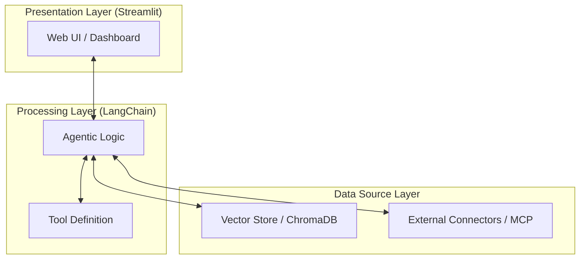

<p align="center">
  
</p>

# Grifo

<p align="center">
  
  
  
  
  
</p>

> [!IMPORTANT]
> **Status: Em desenvolvimento.**
> As funcionalidades planejadas e as especificações detalhadas podem ser encontradas na pasta `specs/`

Este repositório é uma implementação padrão de referência para aplicações de Agentes de IA baseada no padrão de **3 camadas (3-Tier Architecture)**. O objetivo é fornecer uma estrutura robusta, escalável e pronta para a era dos Agentes de IA (2024-2026).

## 🚀 Funcionalidades Principais

- 🧠 **Agente Reflexivo**: Orquestração de raciocínio avançado com ciclos de crítica e refinamento.
- 📚 **RAG (Retrieval-Augmented Generation)**: Busca semântica eficiente utilizando ChromaDB.
- 🛠️ **Ecossistema de Ferramentas**: Integração nativa com ferramentas e APIs externas.
- 🖥️ **Interface Moderna**: Dashboard interativo e chat desenvolvidos com Streamlit.
- 🏗️ **Arquitetura 3-Tier**: Separação clara entre Apresentação, Processamento e Dados.

## 🏗️ Arquitetura do Sistema

O projeto segue a separação lógica e física proposta para sistemas agentizados modernos:



---

## 📂 Estrutura do Projeto

- **[app/presentation/](file:///home/gusarti/pessoal/code/agent-stack/app/presentation/)**: Interface do usuário e experiência visual.
- **[app/processing/](file:///home/gusarti/pessoal/code/agent-stack/app/processing/)**: O "cérebro" do agente, orquestração e lógica de raciocínio.
- **[app/data_source/](file:///home/gusarti/pessoal/code/agent-stack/app/data_source/)**: Conectores de dados, bases vetoriais e APIs externas.

## 🛠️ Como Rodar

### Pré-requisitos
- Python 3.12+
- Gerenciador de dependências [uv](https://github.com/astral-sh/uv) (recomendado) ou `pip`.

### Instalação

1. **Clone o repositório:**

   ```bash
   git clone https://github.com/seu-usuario/projeto-grifo.git
   cd projeto-grifo
   ```

2. **Configure o ambiente:**

   ```bash
   # Usando uv (recomendado)
   uv venv
   source .venv/bin/activate  # Linux/macOS
   uv sync
   ```

3. **Configuração de Variáveis:**

   Crie um arquivo `.env` na raiz do projeto seguindo o modelo e adicione suas chaves de API:
   ```env
   OPENAI_API_KEY=sua_chave_aqui
   ```

4. **Execute a aplicação:**

   ```bash
   streamlit run app/presentation/web_ui.py
   ```

---

## 📜 Licença

Distribuído sob a licença MIT. Veja `LICENSE` para mais informações.

## 👤 Autor

**Gustavo** - *AI Enthusiast & Developer*
- LinkedIn: [@gmsarti](https://www.linkedin.com/in/gmsarti/)
- GitHub: [@gmsarti](https://github.com/gmsarti)