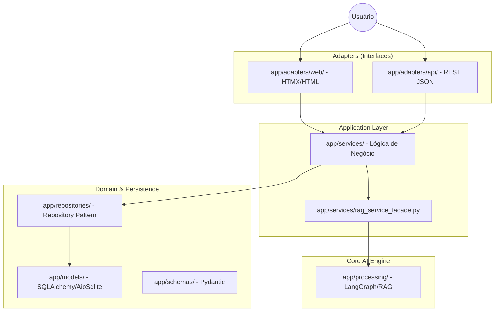

<p align="center">
  
</p>

# Grifo

<p align="center">
  
  
  
  
  
  
  
</p>

> [!IMPORTANT]
> **Status: Em desenvolvimento ativo.**
> O projeto possui duas interfaces de usuário: uma aplicação web completa com FastAPI + HTMX e um frontend interativo em Streamlit.

O **Grifo** é uma implementação de referência para sistemas de Agentes de IA baseada no padrão de **Arquitetura em 3 Camadas (3-Tier Architecture)**. Ele combina orquestração avançada de agentes com uma interface moderna e resiliente.

## 🚀 Funcionalidades Principais

- 🧠 **Agente Reflexivo**: Orquestração com ciclos de crítica e refinamento utilizando LangGraph.
- 📚 **RAG (Retrieval-Augmented Generation)**: Busca semântica e gestão de documentos com ChromaDB.
- 🖥️ **Interface Web (HTMX)**: UI premium inspirada em estéticas clássicas, construída com HTMX, Tailwind CSS e foco em UX.
- 🎛️ **Interface Streamlit**: Frontend interativo para exploração do sistema — chat, projetos, documentos e memória.
- 🔐 **Autenticação**: Sistema de login e registro seguro com JWT.
- 📂 **Gestão de Documentos**: Upload de arquivos e ingestão por URL para alimentação do RAG.
- 🛠️ **Ferramentas de Pesquisa**: Integração nativa com Tavily Search para buscas em tempo real.
- 📊 **Observabilidade**: Rastreamento completo com LangSmith e logs estruturados.

## 🏗️ Arquitetura do Sistema

O projeto segue os princípios de **Clean Architecture**, garantindo que o núcleo da lógica de IA seja independente de frameworks web ou bancos de dados.


```mermaid
graph TD
    User((Usuário))

    subgraph "Adapters (Interfaces)"
        Web[app/adapters/web/ - HTMX/HTML]
        API[app/adapters/api/ - REST JSON]
    end

    subgraph "Application Layer"
        Services[app/services/ - Lógica de Negócio]
        RAGFacade[app/services/rag_service_facade.py]
    end

    subgraph "Domain & Persistence"
        Repos[app/repositories/ - Repository Pattern]
        Models[app/models/ - SQLAlchemy/AioSqlite]
        Schemas[app/schemas/ - Pydantic]
    end

    subgraph "Core AI Engine"
        IA[app/processing/ - LangGraph/RAG]
    end

    User --> Web
    User --> API
    Web --> Services
    API --> Services
    Services --> Repos
    Services --> RAGFacade
    Repos --> Models
    RAGFacade --> IA
```

## 🛠️ Como Rodar

### Pré-requisitos
- Python 3.12+
- Gerenciador [uv](https://github.com/astral-sh/uv) (altamente recomendado).

### Instalação

1. **Clone o repositório:**
   ```bash
   git clone https://github.com/gmsarti/grifo.git
   cd grifo
   ```

2. **Instale as dependências:**
   ```bash
   uv sync
   ```

3. **Configure as variáveis de ambiente:**
   Crie um arquivo `.env` baseado no exemplo abaixo:
   ```env
   OPENAI_API_KEY=sk-...
   TAVILY_API_KEY=tvly-...
   MODEL_PROVIDER=openai
   MODEL_REASONER=gpt-4o
   MODEL_FAST=gpt-4o-mini
   
   # Opcional: LangSmith para observabilidade
   LANGSMITH_TRACING=true
   LANGSMITH_API_KEY=lsv2_pt_...
   ```

4. **Inicie o servidor da API:**
   ```bash
   uv run uvicorn app.main:app --host 0.0.0.0 --port 8000 --reload
   ```
   Acesse:
   - Interface Web (HTMX): [http://localhost:8000/web/](http://localhost:8000/web/)
   - Documentação da API: [http://localhost:8000/docs](http://localhost:8000/docs)

5. **(Opcional) Inicie o frontend Streamlit** em outro terminal:
   ```bash
   uv run streamlit run frontend/app.py
   ```
   Acesse: [http://localhost:8501](http://localhost:8501)

### Rodando Testes
```bash
uv run pytest
```

---

## 🎛️ Frontend Streamlit

O frontend Streamlit oferece uma interface alternativa e interativa para explorar todas as capacidades do Grifo. Ele se comunica com a API REST e requer que o servidor esteja rodando.

### Estrutura

```
frontend/
├── app.py                  # Página inicial: login e cadastro
├── utils/
│   └── api_client.py       # Cliente HTTP para a API
└── pages/
    ├── 1_Projetos.py       # Gerenciamento de projetos
    ├── 2_Chat.py           # Interface de chat com o agente
    ├── 3_Documentos.py     # Ingestão e remoção de documentos
    └── 4_Memoria.py        # Visualização de fatos e limpeza de memória
```

### Como usar

#### 1. Login / Cadastro (`app.py`)

Na página inicial você pode criar uma conta ou fazer login. O token JWT é armazenado na sessão e enviado automaticamente nas demais páginas.

#### 2. Projetos

- **Listar** todos os seus projetos com nome, descrição e system prompt.
- **Criar** um novo projeto informando nome (obrigatório), descrição e a instrução de sistema que o agente usará naquele contexto.

#### 3. Chat

Configure na barra lateral:

| Campo | Descrição |
|-------|-----------|
| **Project ID** | Identificador do projeto (use o `id` retornado na página Projetos) |
| **User ID** | Identificador do usuário para rastreamento de memória |
| **Modo** | `reflexion` (agente com ciclos de crítica) ou `simple` |
| **Máx. iterações** | Quantas rodadas de refinamento o agente pode executar |
| **Busca web** | Habilita ou desabilita o Tavily Search |

Cada resposta exibe, em um expansor, o **trace** do raciocínio, as **fontes** utilizadas (web e locais) e as **métricas de uso** (tokens, custo e latência).

Clique em **Nova conversa** para iniciar uma thread com ID diferente.

#### 4. Documentos

- **Upload de arquivo**: suporta qualquer formato compatível com o pipeline de ingestão.
- **Ingestão por URL**: informe uma URL pública para extrair e indexar o conteúdo.
- **Listagem**: visualize todos os documentos indexados no projeto.
- **Remoção**: exclua documentos individualmente do vector store.

O campo **Project ID** na sidebar define em qual projeto os documentos são gerenciados.

#### 5. Memória

Informe um **Thread ID** (copiado da página de Chat) para:
- Visualizar os **fatos** extraídos pelo agente ao longo da conversa, organizados por tópico.
- **Limpar** o histórico de mensagens e todos os fatos da thread (ação irreversível).

---

## 📜 Licença

Distribuído sob a licença MIT. Veja `LICENSE` para mais informações.

## 👤 Autor

**Gustavo Sarti** - *AI Enthusiast & Developer*
- LinkedIn: [@gmsarti](https://www.linkedin.com/in/gmsarti/)
- GitHub: [@gmsarti](https://github.com/gmsarti)