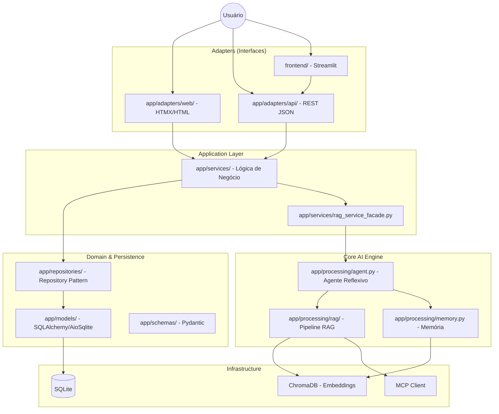
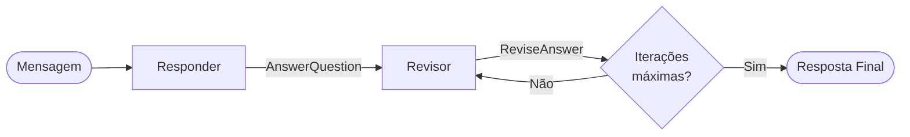
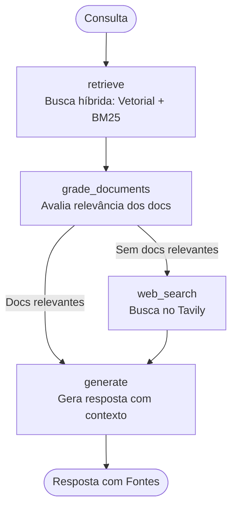

<p align="center">
  
</p>

# Grifo

<p align="center">
  
  
  
  
  
  
  
</p>

> [!IMPORTANT]
> **Status: Em desenvolvimento ativo.**
> O projeto possui duas interfaces de usuário: uma aplicação web completa com FastAPI + HTMX e um frontend interativo em Streamlit.

O **Grifo** é uma implementação de referência para sistemas de Agentes de IA baseada no padrão de **Arquitetura em 3 Camadas (3-Tier Architecture)**. Ele combina orquestração avançada de agentes com uma interface moderna e resiliente.

## 🚀 Funcionalidades Principais

- 🧠 **Agente Reflexivo**: Orquestração com ciclos de crítica e refinamento utilizando LangGraph.
- 📚 **RAG Híbrido**: Busca semântica (vetorial) + BM25 lexical com Reciprocal Rank Fusion, alimentada por ChromaDB.
- 🖥️ **Interface Web (HTMX)**: UI premium inspirada em estéticas clássicas, construída com HTMX, Tailwind CSS e foco em UX.
- 🎛️ **Interface Streamlit**: Frontend interativo para exploração do sistema — chat, projetos, documentos e memória.
- 🔐 **Autenticação**: Sistema de login e registro seguro com JWT.
- 📂 **Gestão de Documentos**: Upload de arquivos (PDF, DOCX, CSV, TXT, MD) e ingestão por URL para alimentação do RAG.
- 🧩 **Memória em Duas Camadas**: Memória de curto prazo por thread (ChromaDB) e de longo prazo entre sessões (LangGraph Store).
- 🛠️ **Ferramentas de Pesquisa**: Integração nativa com Tavily Search para buscas em tempo real como fallback do RAG.
- 🔌 **Integração MCP**: Suporte a ferramentas externas via Model Context Protocol.
- 📊 **Observabilidade**: Rastreamento completo com LangSmith, logs estruturados em JSON e tracking de tokens/custo por interação.

## 🏗️ Arquitetura do Sistema

O projeto segue os princípios de **Clean Architecture**, garantindo que o núcleo da lógica de IA seja independente de frameworks web ou bancos de dados.


```mermaid
graph TD
    User((Usuário))

    subgraph "Adapters (Interfaces)"
        Web[app/adapters/web/ - HTMX/HTML]
        API[app/adapters/api/ - REST JSON]
        ST[frontend/ - Streamlit]
    end

    subgraph "Application Layer"
        Services[app/services/ - Lógica de Negócio]
        RAGFacade[app/services/rag_service_facade.py]
    end

    subgraph "Domain & Persistence"
        Repos[app/repositories/ - Repository Pattern]
        Models[app/models/ - SQLAlchemy/AioSqlite]
        Schemas[app/schemas/ - Pydantic]
    end

    subgraph "Core AI Engine"
        Agent[app/processing/agent.py - Agente Reflexivo]
        RAG[app/processing/rag/ - Pipeline RAG]
        Memory[app/processing/memory.py - Memória]
    end

    subgraph "Infrastructure"
        VectorStore[ChromaDB - Embeddings]
        DB[(SQLite)]
        MCP[MCP Client]
    end

    User --> Web
    User --> API
    User --> ST
    ST --> API
    Web --> Services
    API --> Services
    Services --> Repos
    Services --> RAGFacade
    Repos --> Models
    Models --> DB
    RAGFacade --> Agent
    Agent --> RAG
    Agent --> Memory
    RAG --> VectorStore
    RAG --> MCP
    Memory --> VectorStore
```

## 🤖 Pipeline do Agente Reflexivo

O agente usa o padrão **Reflexion** para refinar suas respostas iterativamente:


```mermaid
graph LR
    Input([Mensagem]) --> Responder
    Responder -->|AnswerQuestion| Revisor
    Revisor -->|ReviseAnswer| Check{Iterações\nmáximas?}
    Check -->|Não| Revisor
    Check -->|Sim| Output([Resposta Final])
```

Cada iteração usa duas chains distintas:
- **First Responder** (`get_first_responder`): Gera a resposta inicial com base no contexto e ferramentas disponíveis.
- **Revisor** (`get_revisor`): Critica e refina a resposta anterior, podendo buscar mais informações.

## 📖 Pipeline RAG

Quando o agente consulta a base de conhecimento, um grafo RAG dedicado é executado:


```mermaid
graph TD
    Query([Consulta]) --> Retrieve[retrieve\nBusca híbrida: Vetorial + BM25]
    Retrieve --> Grade[grade_documents\nAvalia relevância dos docs]
    Grade -->|Docs relevantes| Generate[generate\nGera resposta com contexto]
    Grade -->|Sem docs relevantes| WebSearch[web_search\nBusca no Tavily]
    WebSearch --> Generate
    Generate --> Answer([Resposta com Fontes])
```

A recuperação usa **Reciprocal Rank Fusion (RRF)** para combinar os resultados vetoriais e BM25, garantindo maior cobertura semântica e lexical.

## 🧠 Sistema de Memória

O Grifo mantém dois tipos de memória independentes:

| Tipo | Implementação | Escopo | Uso |
|------|--------------|--------|-----|
| **Curto prazo** | `VectorizedMessageHistory` (ChromaDB) | Por thread | Histórico da conversa atual; busca semântica nas mensagens anteriores |
| **Longo prazo** | `StoreMemoryManager` (LangGraph Store) | Por usuário | Fatos extraídos automaticamente das conversas; persiste entre sessões |

A extração de fatos para a memória de longo prazo é feita automaticamente pela chain `get_knowledge_extractor` ao final de cada interação.

## 🛠️ Como Rodar

### Pré-requisitos
- Python 3.12+
- Gerenciador [uv](https://github.com/astral-sh/uv) (altamente recomendado).

### Instalação

1. **Clone o repositório:**
   ```bash
   git clone https://github.com/gmsarti/grifo.git
   cd grifo
   ```

2. **Instale as dependências:**
   ```bash
   uv sync
   ```

3. **Configure as variáveis de ambiente:**
   Crie um arquivo `.env` baseado no exemplo abaixo:
   ```env
   # API Keys
   OPENAI_API_KEY=sk-...
   TAVILY_API_KEY=tvly-...        # opcional: habilita busca web

   # Provedor de LLM (openai ou deepseek)
   MODEL_PROVIDER=openai
   MODEL_REASONER=gpt-4o          # modelo para raciocínio complexo
   MODEL_FAST=gpt-4o-mini         # modelo custo-eficiente

   # Deepseek (se MODEL_PROVIDER=deepseek)
   # DEEPSEEK_API_KEY=sk-...

   # Segurança
   SECRET_KEY=troque-por-uma-chave-segura
   ACCESS_TOKEN_EXPIRE_MINUTES=30

   # Persistência (opcional — valores padrão abaixo)
   DATABASE_URL=sqlite+aiosqlite:///./data/sql_app.db
   CHROMA_PERSIST_DIRECTORY=./data/chroma

   # Processamento de documentos (opcional)
   CHUNK_SIZE=1000
   CHUNK_OVERLAP=200

   # Agente (opcional)
   REFLEXION_MAX_ITERATIONS=2

   # LangSmith — observabilidade (opcional)
   LANGSMITH_TRACING=true
   LANGSMITH_API_KEY=lsv2_pt_...
   LANGSMITH_PROJECT=grifo
   ```

### Executando

**Opção A — API + interface HTMX:**
```bash
uv run uvicorn app.main:app --host 0.0.0.0 --port 8000 --reload
```
- Interface Web: [http://localhost:8000/web/](http://localhost:8000/web/)
- Documentação da API: [http://localhost:8000/docs](http://localhost:8000/docs)

**Opção B — Com frontend Streamlit** (em terminais separados):
```bash
# Terminal 1
uv run uvicorn app.main:app --host 0.0.0.0 --port 8000 --reload

# Terminal 2
uv run streamlit run frontend/app.py
```
Acesse o Streamlit em: [http://localhost:8501](http://localhost:8501)

**Opção C — Script de desenvolvimento** (inicia API + Streamlit simultaneamente):
```bash
uv run python main.py
```

### Rodando Testes
```bash
uv run pytest
```

---

## 🎛️ Frontend Streamlit

O frontend Streamlit oferece uma interface alternativa e interativa para explorar todas as capacidades do Grifo. Ele se comunica com a API REST e requer que o servidor esteja rodando.

### Estrutura

```
frontend/
├── app.py                  # Página inicial: login e cadastro
├── utils/
│   └── api_client.py       # Cliente HTTP para a API
└── pages/
    ├── 1_Projetos.py       # Gerenciamento de projetos
    ├── 2_Chat.py           # Interface de chat com o agente
    ├── 3_Documentos.py     # Ingestão e remoção de documentos
    └── 4_Memoria.py        # Visualização de fatos e limpeza de memória
```

### Como usar

#### 1. Login / Cadastro (`app.py`)

Na página inicial você pode criar uma conta ou fazer login. O token JWT é armazenado na sessão e enviado automaticamente nas demais páginas.

#### 2. Projetos

- **Listar** todos os seus projetos com nome, descrição e system prompt.
- **Criar** um novo projeto informando nome (obrigatório), descrição e a instrução de sistema que o agente usará naquele contexto.

#### 3. Chat

Configure na barra lateral:

| Campo | Descrição |
|-------|-----------|
| **Project ID** | Identificador do projeto (use o `id` retornado na página Projetos) |
| **User ID** | Identificador do usuário para rastreamento de memória |
| **Modo** | `reflexion` (agente com ciclos de crítica) ou `simple` |
| **Máx. iterações** | Quantas rodadas de refinamento o agente pode executar |
| **Busca web** | Habilita ou desabilita o Tavily Search |

Cada resposta exibe, em um expansor, o **trace** do raciocínio, as **fontes** utilizadas (web e locais) e as **métricas de uso** (tokens, custo e latência).

Clique em **Nova conversa** para iniciar uma thread com ID diferente.

#### 4. Documentos

Formatos suportados para upload: **PDF, DOCX, CSV, TXT, MD**.

- **Upload de arquivo**: envie um dos formatos suportados para indexação.
- **Ingestão por URL**: informe uma URL pública para extrair e indexar o conteúdo.
- **Listagem**: visualize todos os documentos indexados no projeto.
- **Remoção**: exclua documentos individualmente do vector store.

O campo **Project ID** na sidebar define em qual projeto os documentos são gerenciados.

#### 5. Memória

Informe um **Thread ID** (copiado da página de Chat) para:
- Visualizar os **fatos** extraídos pelo agente ao longo da conversa, organizados por tópico.
- **Limpar** o histórico de mensagens e todos os fatos da thread (ação irreversível).

---

## 📁 Estrutura do Projeto

```
grifo/
├── app/
│   ├── adapters/            # Interfaces externas
│   │   ├── api/             # Rotas REST (FastAPI)
│   │   └── web/             # Templates HTMX + Jinja2
│   ├── core/                # Infraestrutura (config, DB, LLM, auth, logging)
│   ├── data_source/         # Camada de dados (loaders, vector store, MCP)
│   ├── models/              # Modelos SQLAlchemy (User, Project, Chat)
│   ├── processing/          # Motor de IA
│   │   ├── agent.py         # Orquestrador Reflexion (LangGraph)
│   │   ├── chains.py        # Chains LLM (responder, revisor, extrator)
│   │   ├── memory.py        # Memória curto e longo prazo
│   │   ├── tools.py         # Ferramentas do agente (RAG, MCP)
│   │   └── rag/             # Grafo RAG (retrieve → grade → generate → search)
│   ├── repositories/        # Padrão Repository (acesso a dados)
│   ├── schemas/             # Schemas Pydantic (validação)
│   ├── services/            # Lógica de negócio e orquestração
│   ├── utils/               # Utilitários (processamento de texto)
│   └── main.py              # Inicialização do app FastAPI
├── frontend/                # Interface Streamlit
├── tests/                   # Suite de testes (unit + integration)
├── specs/                   # Documentação de arquitetura e decisões
├── scripts/                 # Scripts utilitários
├── data/                    # SQLite + ChromaDB (gerado em runtime)
├── main.py                  # Script de desenvolvimento (API + Streamlit)
└── pyproject.toml           # Dependências e configuração
```

---

## 📜 Licença

Distribuído sob a licença MIT. Veja `LICENSE` para mais informações.

## 👤 Autor

**Gustavo Sarti** - *AI Enthusiast & Developer*
- LinkedIn: [@gmsarti](https://www.linkedin.com/in/gmsarti/)
- GitHub: [@gmsarti](https://github.com/gmsarti)
