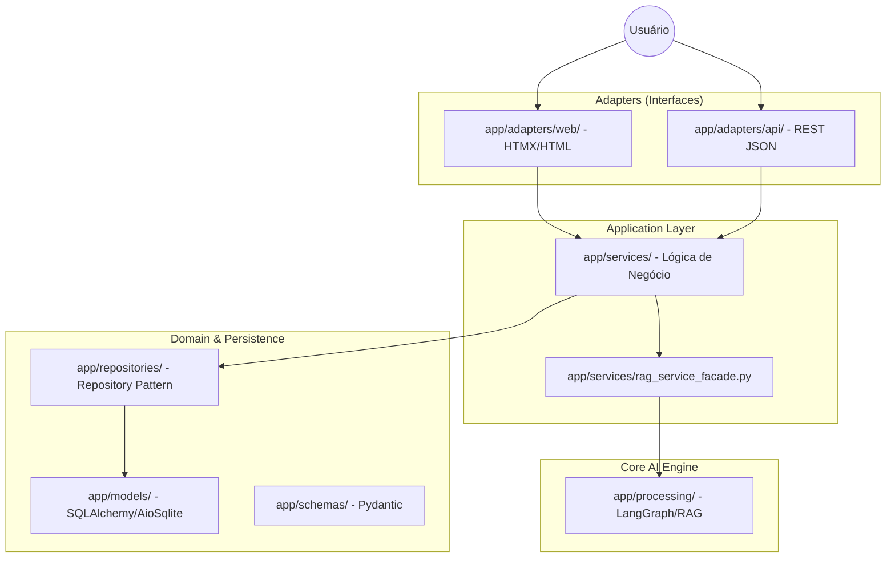

<p align="center">
  
</p>

# Grifo

<p align="center">
  
  
  
  
  
  
</p>

> [!IMPORTANT]
> **Status: Em desenvolvimento ativo.**
> Este projeto evoluiu de um protótipo Streamlit para uma aplicação web completa utilizando FastAPI e HTMX.

O **Grifo** é uma implementação de referência para sistemas de Agentes de IA baseada no padrão de **Arquitetura em 3 Camadas (3-Tier Architecture)**. Ele combina orquestração avançada de agentes com uma interface moderna e resiliente.

## 🚀 Funcionalidades Principais

- 🧠 **Agente Reflexivo**: Orquestração com ciclos de crítica e refinamento utilizando LangGraph.
- 📚 **RAG (Retrieval-Augmented Generation)**: Busca semântica e gestão de documentos com ChromaDB.
- 🖥️ **Interface Modern Scriptorium**: UI premium inspirada em estéticas clássicas, construída com HTMX, Tailwind CSS e foco em UX.
- 🔐 **Autenticação Web**: Sistema de login e registro seguro utilizando Cookies HTTP-Only e JWT.
- 📂 **Gestão de Documentos**: Upload, listagem e exclusão de documentos para alimentação do RAG.
- 🛠️ **Ferramentas de Pesquisa**: Integração nativa com Tavily Search para buscas em tempo real.
- 📊 **Observabilidade**: Rastreamento completo com LangSmith e logs estruturados.

## 🏗️ Arquitetura do Sistema

O projeto segue os princípios de **Clean Architecture**, garantindo que o núcleo da lógica de IA seja independente de frameworks web ou bancos de dados.


```mermaid
graph TD
    User((Usuário))

    subgraph "Adapters (Interfaces)"
        Web[app/adapters/web/ - HTMX/HTML]
        API[app/adapters/api/ - REST JSON]
    end

    subgraph "Application Layer"
        Services[app/services/ - Lógica de Negócio]
        RAGFacade[app/services/rag_service_facade.py]
    end

    subgraph "Domain & Persistence"
        Repos[app/repositories/ - Repository Pattern]
        Models[app/models/ - SQLAlchemy/AioSqlite]
        Schemas[app/schemas/ - Pydantic]
    end

    subgraph "Core AI Engine"
        IA[app/processing/ - LangGraph/RAG]
    end

    User --> Web
    User --> API
    Web --> Services
    API --> Services
    Services --> Repos
    Services --> RAGFacade
    Repos --> Models
    RAGFacade --> IA
```

## 🛠️ Como Rodar

### Pré-requisitos
- Python 3.12+
- Gerenciador [uv](https://github.com/astral-sh/uv) (altamente recomendado).

### Instalação

1. **Clone o repositório:**
   ```bash
   git clone https://github.com/gmsarti/grifo.git
   cd grifo
   ```

2. **Instale as dependências:**
   ```bash
   uv sync
   ```

3. **Configure as variáveis de ambiente:**
   Crie um arquivo `.env` baseado no exemplo abaixo:
   ```env
   OPENAI_API_KEY=sk-...
   TAVILY_API_KEY=tvly-...
   MODEL_PROVIDER=openai
   MODEL_REASONER=gpt-4o
   MODEL_FAST=gpt-4o-mini
   
   # Opcional: LangSmith para observabilidade
   LANGSMITH_TRACING=true
   LANGSMITH_API_KEY=lsv2_pt_...
   ```

4. **Inicie a aplicação:**
   ```bash
   uv run uvicorn app.main:app --host 0.0.0.0 --port 8000 --reload
   ```
   Acesse:
   - Interface Web: [http://localhost:8000/web/](http://localhost:8000/web/)
   - API Docs: [http://localhost:8000/docs](http://localhost:8000/docs)

### Rodando Testes
```bash
uv run pytest
```

---

## 📜 Licença

Distribuído sob a licença MIT. Veja `LICENSE` para mais informações.

## 👤 Autor

**Gustavo Sarti** - *AI Enthusiast & Developer*
- LinkedIn: [@gmsarti](https://www.linkedin.com/in/gmsarti/)
- GitHub: [@gmsarti](https://github.com/gmsarti)