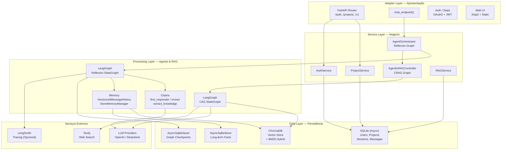
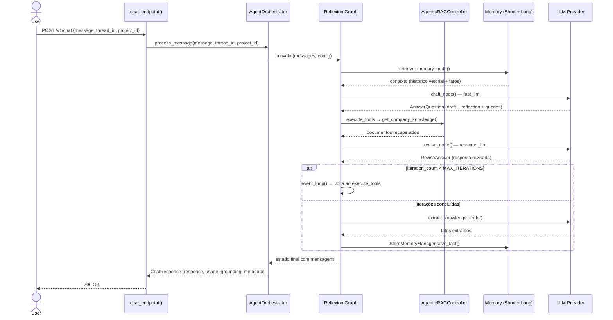
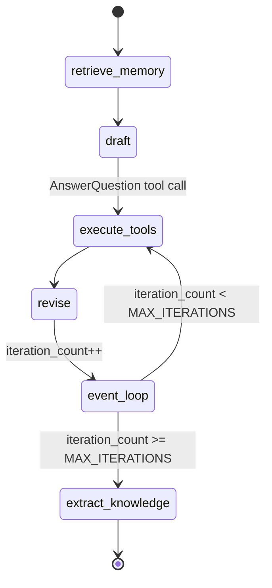
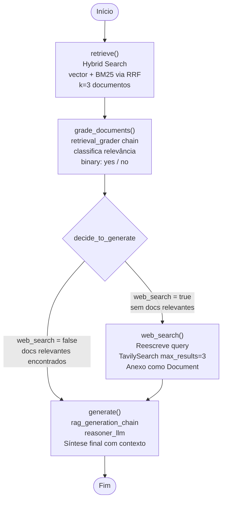
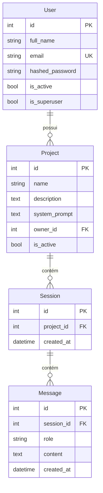
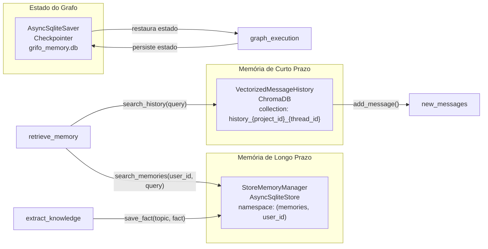
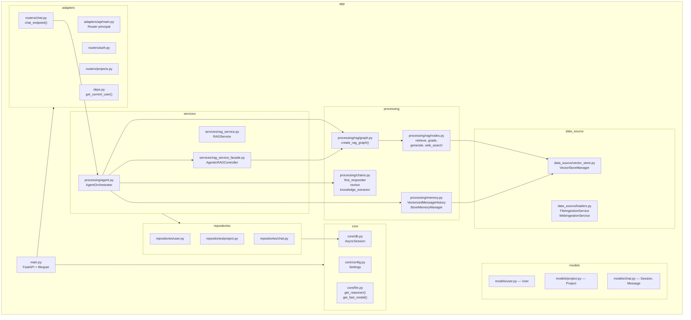

# Grifo — Documentação de Arquitetura

Este documento descreve a arquitetura do Grifo com diagramas gerados via Mermaid.js, renderizáveis no GitHub e no VSCode (extensão Markdown Preview Mermaid Support).

---

## 1. Visão Geral — Arquitetura em 3 Camadas

O Grifo segue um padrão de 3 camadas: **Adapter** (apresentação), **Service** (lógica de negócio) e **Processing/Data** (agente e persistência).



---

## 2. Fluxo de uma Requisição de Chat



---

## 3. Grafo do Agente Reflexion (LangGraph)



**Nós do grafo:**

| Nó | Modelo | Responsabilidade |
|----|--------|-----------------|
| `retrieve_memory` | — | Busca histórico vetorizado + fatos de longo prazo |
| `draft` | `fast_llm` (gpt-4o-mini) | Gera resposta inicial com reflexão e queries de busca |
| `execute_tools` | ToolNode | Executa `AnswerQuestion` / `ReviseAnswer` |
| `revise` | `reasoner_llm` (gpt-4o) | Refina a resposta com base na reflexão |
| `extract_knowledge` | `reasoner_llm` | Extrai fatos novos e persiste na memória de longo prazo |

---

## 4. Grafo do CRAG — AgenticRAGController



**Estado do grafo (`GraphState`):**

| Campo | Tipo | Descrição |
|-------|------|-----------|
| `question` | `str` | Pergunta do usuário |
| `generation` | `str` | Resposta gerada |
| `web_search` | `bool` | Flag: fallback para busca web |
| `documents` | `list[Document]` | Documentos recuperados/filtrados |

---

## 5. Modelo de Dados (ER)



---

## 6. Arquitetura de Memória



---

## 7. Pipeline de Ingestão de Documentos

```mermaid
flowchart TD
    A([Upload de Arquivo\n ou URL]) --> B{Tipo de fonte}

    B -- Arquivo -- > C["FileIngestionService\nValidação: extensão, tamanho max 50MB\nPDF, DOCX, CSV, TXT, MD"]
    B -- URL --> D["WebIngestionService\nWebBaseLoader(url)"]

    C --> E["RecursiveCharacterTextSplitter\nchunk_size=1000\noverlap=200"]
    D --> E

    E --> F["VectorStoreManager.add_documents()"]

    F --> G["ChromaDB\nVector Embeddings\nOpenAIEmbeddings"]
    F --> H["BM25 Index\nReconstruído sobre todos os docs"]

    G --> I["HybridRetriever\nRRF: score = 1/(60+rank_vec) + 1/(60+rank_bm25)"]
    H --> I

    I --> J[(Persistido em\n./data/chroma/{project_id})]
```

---

## 8. Componentes e Arquivos Principais


