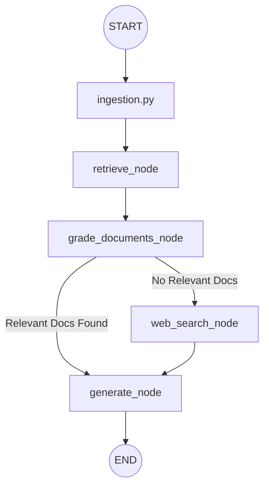

# RAG Agentic Specification

The RAG Agentic system implements a **Corrective RAG (CRAG)** architecture. It enhances standard RAG by introducing a rejuvenation step: grading retrieved documents for relevance and triggering a web search if necessary to supplement the context.

## Architecture & System Design

The system is designed as a stateful graph following the CRAG pattern.

### Conceptual Workflow

### Core Components

1.  **Ingestion (`ingestion.py`)**:
    - **Source**: Web content loading via `WebBaseLoader`.
    - **Processing**: Semantic chunking using `RecursiveCharacterTextSplitter` (chunk size 256).
    - **Storage**: **ChromaDB** vector store with `OpenAIEmbeddings`.
    - **Persistence**: Data is saved in `./.chroma_db`.

2.  **Retrieval Grader (`retrieval_grader.py`)**:
    - **Logic**: Binary classification (`yes`/`no`) of document relevance using `gpt-4o-mini`.
    - **Output**: Structured output via Pydantic (`GradeDocuments` model).

3.  **Retrieve Node (`retrieve.py`)**:
    - Invokes the `retriever` from `ingestion.py` to fetch top-k (k=3) relevant documents.

## Functional Requirements

### State Management (`state.py`)
The `GraphState` (TypedDict) tracks:
- `question`: The original user query.
- `generation`: The final LLM response.
- `web_search`: Boolean flag to trigger fallback search.
- `documents`: List of retrieved/filtered documents.

### Implementation Backlog (Completing the Graph)

- [ ] **Define Nodes**:
    - [ ] Implement `grade_documents` node in `nodes/grade_documents.py`.
    - [ ] Implement `web_search` node (integrating Tavily).
- [ ] **Define Conditional Logic**:
    - [ ] Create `decide_to_generate` function to check the `web_search` flag.
- [ ] **Construct Graph (`graph.py`)**:
    - [ ] assemble nodes and edges using `StateGraph(GraphState)`.
    - [ ] compile the workflow.
- [ ] **Main Entry Point (`main.py`)**:
    - [ ] Implement the execution loop to invoke the compiled graph.

## Technical Specifications

### Key Dependencies
- `langchain-chroma`: Vector store management.
- `langchain-community`: Web loaders and tools.
- `langchain-openai`: Embeddings and LLM.
- `langgraph`: Workflow orchestration.
