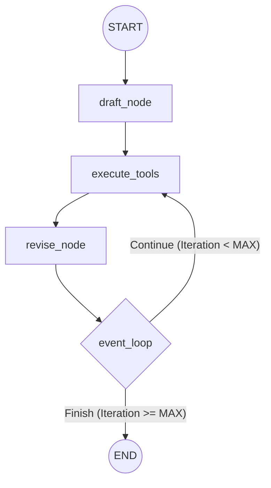

# Especificação: Reflexion Agent

Este documento define a arquitetura e o funcionamento do **Reflexion Agent**, um agente capaz de realizar buscas no Vector Store e aprimorar iterativamente suas respostas através de um ciclo de reflexão e crítica.

## Arquitetura e Fluxo de Trabalho

O agente utiliza um padrão de "Reflexão" (Self-Correction) para garantir que a resposta final seja precisa, fundamentada e livre de alucinações.

### 1. Grafo de Estados (LangGraph)

O fluxo é gerenciado por uma máquina de estados com o seguinte padrão cíclico:



- **Node: Draft:** Gera a resposta inicial (~250 palavras) e a primeira reflexão.
- **Node: Execute Tools:** A `ToolNode` que executa as buscas recomendadas (queries) geradas pelo agente.
- **Node: Revise:** Reescreve a resposta com base no feedback e nos novos dados coletados.
- **Edge: Event Loop:** Controla o ciclo de repetição baseado no número de visitas às ferramentas (`REFLEXION_MAX_ITERATIONS` configurado em `config.py`).

### 2. Estrutura de Mensagens e Estado

Utiliza `MessagesState` do LangGraph para manter o histórico de interações, permitindo que o revisor acesse tanto o rascunho anterior quanto as críticas.

## Camada de Serviço: AgentOrchestrator

Para expor o grafo de forma limpa, será implementada uma classe `AgentOrchestrator` em `app/processing/agent.py`:

- **Função:** Encapsular a lógica de inicialização do compilador do LangGraph e gerenciar o `thread_id`.
- **Interface:** Expor o método `async def process_message(self, message: str, thread_id: str = None) -> ChatResponse`.
- **Orquestração:** O `AgentOrchestrator` deve injetar o `VectorStoreManager` como uma ferramenta dentro do fluxo do grafo.

## Definições Técnicas

### 1. Schemas Pydantic (Output Structuring)

Para garantir que o agente forneça críticas estruturadas, utilizamos os seguintes modelos:

```python
class Reflection(BaseModel):
    missing: str  # O que falta na resposta
    superfluous: str  # O que é desnecessário

class AnswerQuestion(BaseModel):
    answer: str
    reflection: Reflection
    search_queries: List[str]  # queries para busca no Vector Store/Web

class ReviseAnswer(AnswerQuestion):
    references: List[str]  # Fontes utilizadas
```

### 2. Estratégia de Prompts

Os prompts são modulares (`ChatPromptTemplate.partial`):

- **Actor Prompt (Base):**

  ```text
  You are expert researcher.
  Current time: {time}

  1. {first_instruction}
  2. Reflect and critique your answer. Be severe to maximize improvement.
  3. Recommend search queries to research information and improve your answer.
  ```

- **Draft:** Instrução para "Providenciar uma resposta detalhada de ~250 palavras".
- **Revise:**

  ```text
  Revise your previous answer using the new information.
  - You should use the previous critique to improve the story
  - You should use the previous critique to remove superfluous information
  - You should use the previous critique to make the story more suitable to social context
  ```

## Integração com Ferramentas

- **TavilySearch:** Utilizada como ferramenta primária de busca web.
- **Smart Search:** O nó `execute_tools` mapeia as `search_queries` para a ferramenta unificada.
- **Fallback CRAG:** A busca web ocorrerá **internamente** no fluxo de busca do Vector Store se o `retrieval_grader` indicar que os documentos recuperados são irrelevantes.
- **Configurações:** O número máximo de iterações é controlado pela variável `REFLEXION_MAX_ITERATIONS`.

## Dependências Técnicas

- `langchain`: Framework de orquestração.
- `langgraph`: Gestão de estado e fluxos em grafo.
- `langchain_openai`: Provedor de LLM (GPT-4o / GPT-4o-mini).
- `langchain_tavily`: Integração com busca Tavily.

## Perfis de LLM

O agente utiliza perfis de LLM especializados para otimizar custo e qualidade, gerenciados via `app/core/llm.py`:

- **REASONER (`MODEL_REASONER`):** Utilizado para os nós de **Revise** e para a geração de **Critiques (Reflection)**. Requer alta capacidade de raciocínio.
- **FAST (`MODEL_FAST`):** Utilizado para o nó de **Draft** (rascunho inicial) e tarefas de roteamento/classificação auxiliares. Foco em agilidade.

## Gestão de Memória

O agente diferencia entre memória de curto prazo (dentro da sessão) e memória de longo prazo (persistente entre sessões).

### 1. Curto Prazo (Conversational Memory)

- **Implementação:** `ConversationBufferMemory` com vectorstore **ChromaDB**.
- **Objetivo:** Realizar RAG sobre o histórico recente da conversa atual para manter o contexto sem sobrecarregar a janela de contexto do LLM com mensagens irrelevantes.
- **Escopo:** Thread-scoped (gerenciado via `thread_id` no LangGraph).

### 2. Longo Prazo (Cross-Session Memory)

- **Implementação:** LangGraph `BaseStore` (inicialmente `InMemoryStore`, migrando para `PostgresStore`).
- **Objetivo:** Persistir fatos, preferências do usuário e aprendizados do agente entre diferentes sessões.
- **Busca:** Utiliza `store.search()` com embeddings para busca semântica de fatos relevantes ao contexto atual.

## Lista de Tasks (Backlog Detalhado)

### [PHASE 0] Setup e Ambiente

- [x] [TASK-0.1] Configurar `.env` com `OPENAI_API_KEY`, `TAVILY_API_KEY` e `LANGSMITH_API_KEY`.
- [x] [TASK-0.2] Validar instâncias de `Settings` em `app/core/config.py`.
- [x] [TASK-0.3] Instalar dependências: `langgraph`, `langchain-tavily`, `langchain-openai`.

### [PHASE 1] Estrutura e Schemas

- [x] [TASK-1.1] Implementar schemas Pydantic (`Reflection`, `AnswerQuestion`, `ReviseAnswer`) em `schemas.py`.
- [x] [TASK-1.2] Definir o `MessagesState` e a estrutura básica do grafo no LangGraph.
- [X] [TASK-1.3] Criar os templates de prompt base em `chains.py` usando `partial`.

### [PHASE 2] Ferramentas e Chains

- [ ] [TASK-2.1] Configurar `TavilySearch` e criar o `ToolNode` em `tool_executor.py`.
- [ ] [TASK-2.2] Implementar `first_responder` chain com bind de `AnswerQuestion`.
- [ ] [TASK-2.3] Implementar `revisor` chain com bind de `ReviseAnswer`.

### [PHASE 3] Grafo e Orquestração

- [ ] [TASK-3.1] Implementar `draft_node` e `revise_node`.
- [ ] [TASK-3.2] Codificar o `event_loop` para contar `ToolMessage` e respeitar `REFLEXION_MAX_ITERATIONS`.
- [ ] [TASK-3.3] Criar `AgentOrchestrator` em `app/processing/agent.py` para compilar e expor o grafo.
- [ ] [TASK-3.4] Integrar busca híbrida (Vector Store + Tavily fallback) no fluxo de ferramentas.

### [PHASE 4] Gestão de Memória (Curto e Longo Prazo)

- [ ] [TASK-4.1] Implementar `ConversationBufferMemory` com ChromaDB para histórico de mensagens.
- [ ] [TASK-4.2] Configurar `InMemoryStore` para memória de longo prazo (cross-sessões).
- [ ] [TASK-4.3] Implementar busca semântica (`store.search()`) com embeddings na memória de longo prazo.
- [ ] [TASK-4.4] Migrar de `InMemoryStore` para `PostgresStore` para persistência em produção.
- [ ] [TASK-4.5] **Suíte de Testes de Memória**:
  - Validar persistência e recuperação do histórico no ChromaDB.
  - Testar busca semântica no `BaseStore` (InMemory e Postgres).
  - Garantir o isolamento de memória por `thread_id`.

### [PHASE 5] Qualidade e Observabilidade

- [ ] [TASK-5.1] **LangSmith Tracing & Metadata**:
  - Configurar traces detalhados para cada nó (`draft`, `revise`, `execute_tools`).
  - Adicionar metadata customizada: `iteration_count`, `model_name`, `total_tokens`.
- [ ] [TASK-5.2] **Suite de Testes Unitários**:
  - Validar extração de críticas do schema `Reflection`.
  - Testar lógica de saída do `event_loop` em limites de iteração.
  - Mockar respostas de ferramentas para garantir resiliência do revisor.
- [ ] [TASK-5.3] **Avaliação de Qualidade (LLM-as-a-Judge)**:
  - Implementar um avaliador que compare o Primeiro Draft vs. Revisão Final.
  - Critérios: Alinhamento com Direitos Humanos (conforme prompt), Redução de superfluidades, Acurácia factual.
- [ ] [TASK-5.4] **Monitoramento de Custo e Performance**:
  - Rastrear latência média por ciclo de reflexão.
  - Implementar alerta/log para consumo excessivo de tokens em revisões longas.
- [ ] [TASK-5.5] **Dataset de Regressão (Golden Dataset)**:
  - Criar conjunto de 10 perguntas complexas com "gabaritos" de pontos críticos que a reflexão DEVE abordar.
  - Automatizar execução do benchmark para garantir que melhorias no prompt não causem regressão.

---

## Guia de Replicação

Para detalhes sobre como portar este agente para um novo repositório, consulte o [Replication Guide](file:///home/gusarti/pessoal/code/agent-stack/specs/agent/reflexion_agent/replication_guide.md).
