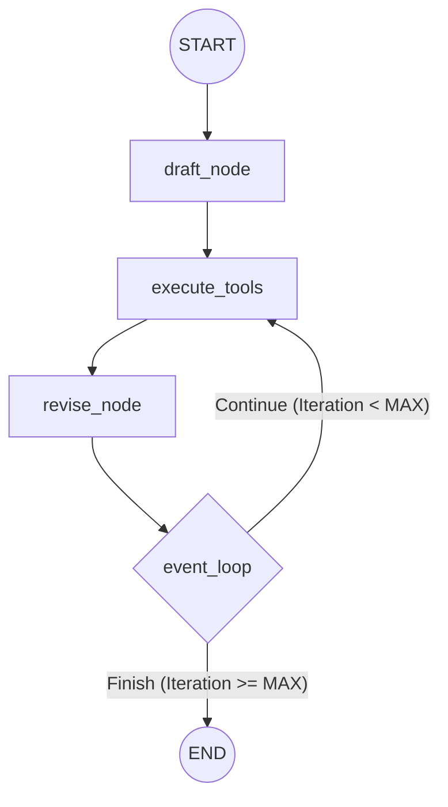

# Reflexion Agent Specification

The Reflexion Agent is a self-correcting agentic system that uses a reflection and critique cycle to improve its answers iteratively. It integrates web search capabilities to validate information and refine responses based on specific critiques.

## Architecture & System Design

The agent is built using **LangGraph**, following a cyclic graph pattern.

### Workflow Diagram



### Nodes Definition

1.  **`draft`**: Generates the initial response to the user's query.
2.  **`execute_tools`**: A `ToolNode` that executes search queries generated by the LLM during the draft or revision phases. It uses **TavilySearch** as the primary tool.
3.  **`revise`**: Re-evaluates the previous answer using the results from the search tools and the generated critique, producing an improved version.

## Functional Requirements

### State Management
The agent uses `MessagesState` (a list of messages) as its core state.

### Prompts

#### Actor Prompt (Base)
```text
You are expert researcher.
Current time: {time}

1. {first_instruction}
2. Reflect and critique your answer. Be severe to maximize improvement.
3. Recommend search queries to research information and improve your answer.
```

#### Task Specific Instructions
- **Draft**: "Provide a detailed ~250 word answer."
- **Revision**: 
  ```text
  Revise your previous answer using the new information.
  - You should use the previous critique to improve the story
  - You should use the previous critique to remove superfluous information
  - You should use the previous critique to make the story more suitable to social context
  ```

## Technical Specifications

### Data Schemas (Pydantic)

- **`Reflection`**:
    - `missing`: Critique of what is missing.
    - `superfluous`: Critique of what is superfluous.

- **`AnswerQuestion`**:
    - `answer`: The ~250 word detailed response.
    - `reflection`: A `Reflection` object.
    - `search_queries`: A list of 1-3 search queries for improvement.

- **`ReviseAnswer`** (Inherits from `AnswerQuestion`):
    - `references`: List of sources used in the revision.

### Key Dependencies
- `langchain`: Orchestration framework.
- `langgraph`: State management and graph workflow.
- `langchain_openai`: LLM provider (e.g., GPT-4o-mini).
- `langchain_tavily`: Search tool integration.

## Implementation Backlog

### Phase 1: Environment & Setup
- [ ] Initialize repository and virtual environment.
- [ ] Create `.env` with `OPENAI_API_KEY` and `TAVILY_API_KEY`.
- [ ] Install dependencies (`langchain`, `langgraph`, `langchain-openai`, `langchain-tavily`, `python-dotenv`).

### Phase 2: Core Components
- [ ] **Schemas**: Implement `Reflection`, `AnswerQuestion`, and `ReviseAnswer` in `schemas.py`.
- [ ] **Tools**: Configure `TavilySearch` and create the `execute_tools` `ToolNode` in `tool_executor.py`.
- [ ] **Chains**: 
    - [ ] Define the base prompt template.
    - [ ] Create the `first_responder` chain with tool-binding.
    - [ ] Create the `revisor` chain with tool-binding.

### Phase 3: Graph Construction
- [ ] Define `draft_node` and `revise_node`.
- [ ] Implement the `event_loop` logic to switch between `execute_tools` and `END` based on the number of `ToolMessage` instances in the state.
- [ ] Build and compile the `StateGraph`.

### Phase 4: Testing & Verification
- [ ] Create a test script to invoke the graph with a human-rights focused query.
- [ ] Verify that the agent performs at least 2 iterations before ending.
- [ ] Inspect the JSON output to ensure the `reflection` and `search_queries` are correctly populated.
