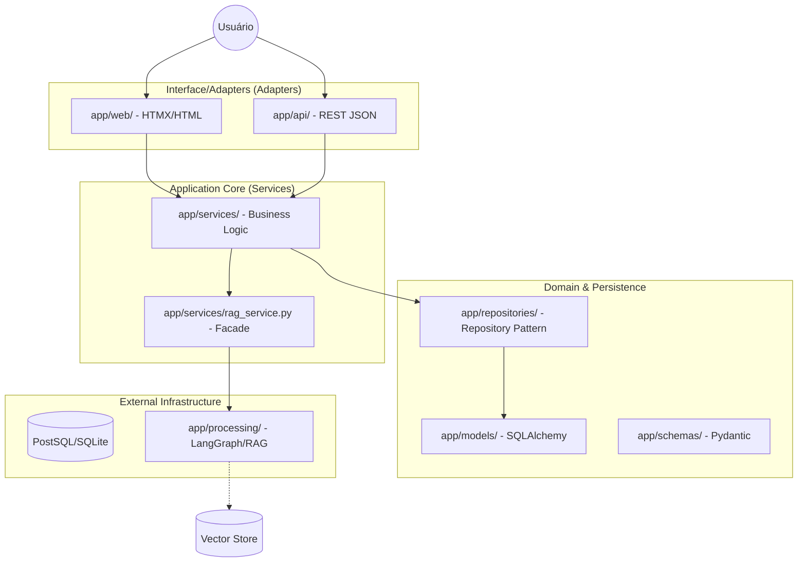

# API & Web Interface Specification (Refined)

Este documento define a arquitetura e os requisitos funcionais do sistema, seguindo princípios de **Clean Architecture** e **Desacoplamento Estrito** conforme as diretrizes da Critique 1.

## Architecture & System Design

O sistema adota o padrão **Hexagonal/Clean Architecture** para garantir que a lógica de negócio (Domain/Services) permaneça isolada de detalhes de infraestrutura (Banco de Dados, Interface Web, API REST).

### Conceptual Workflow

### Core Components & Decoupling

1.  **Repository Pattern (`app/repositories/`)**:
    *   Toda interação com o banco de dados (SQLAlchemy) é encapsulada aqui.
    *   Os `Services` não conhecem o ORM, apenas métodos como `repository.save(user)`.
2.  **Strict Separation of Public Ports**:
    *   `app/api/`: Estritamente RESTful (JSON).
    *   `app/web/`: Estritamente UI (HTMX/Jinja2 fragmentos).
3.  **RAG Facade (`app/services/rag_service.py`)**:
    *   Atua como uma ponte entre a aplicação e o complexo motor de IA (`app/processing/`).
    *   Garante que mudanças no LangGraph não quebrem a Web ou a API.

## Functional Requirements

### Data Modeling (Schema-Driven)
*   **User**: Identidade e credenciais.
*   **Project**: Owner, diretrizes (System Prompt) e metadados.
*   **Session**: Histórico de chat.
*   **Document**: Metadados de arquivos no RAG.

### Technical Stack
*   **Backend**: FastAPI.
*   **Database**: SQLAlchemy (Async) + Alembic.
*   **IA Engine**: LangGraph + ChromaDB.
*   **Frontend**: HTMX + Jinja2 + Tailwind CSS.
